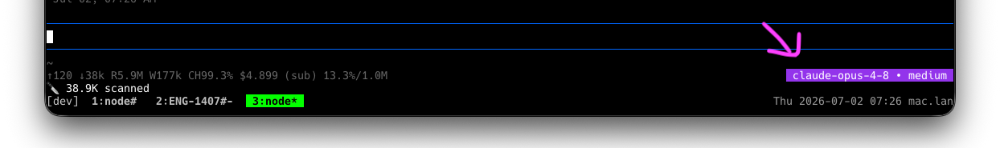

# @yusukeshib/pi-colored-model-status

A [pi](https://pi.dev) extension that color-codes the active model in the
footer, so you can tell at a glance which model family is in use.

It replaces the plain `claude-opus-4-8 • medium` text in the bottom-right of
pi's footer with a background-colored badge. Everything else the default
footer shows (cwd, git branch, token stats, context %, and other extensions'
status line) is faithfully reproduced.



## Colors

Model families are matched by substring against the model id and painted with
strongly distinct hues:

| Family                    | Color            |
| ------------------------- | ---------------- |
| `opus`                    | deep purple      |
| `sonnet`                  | bright cyan-blue |
| `fable`                   | vivid orange     |
| `haiku`                   | green            |
| `gpt`, `o1`, `o3`, `o4`   | OpenAI teal      |
| `gemini`                  | Google blue      |
| `grok`                    | slate            |
| anything else             | gray (fallback)  |

The foreground color (black or white) is chosen automatically from the
background's luminance for readability. The badge follows model changes made
via `/model` or `Ctrl+P`.

## Install

```bash
pi install npm:@yusukeshib/pi-colored-model-status
```

Then reload (or restart pi):

```
/reload
```

To try it for a single run without installing:

```bash
pi -e npm:@yusukeshib/pi-colored-model-status
```

## Customize

Edit the `BADGES` array at the top of
[`extensions/colored-model-status.ts`](extensions/colored-model-status.ts).
Each entry maps substring keywords to an RGB background (and an optional `fg`):

```ts
const BADGES = [
  { match: ["opus"], bg: [147, 51, 234] },
  { match: ["sonnet"], bg: [14, 165, 233] },
  { match: ["fable"], bg: [234, 88, 12] },
  // …add your own, e.g.:
  { match: ["deepseek"], bg: [30, 90, 200] },
];
```

Matching is a case-insensitive substring test against the model id, so `gpt`
matches `gpt-4o`, `o3` matches `o3-mini`, and so on. The first matching entry
wins.

## How it works

`theme.bg()` only accepts theme tokens, so to render arbitrary,
model-specific colors the extension emits raw SGR truecolor escapes
(`48;2;R;G;B`) directly. It uses `ctx.ui.setFooter()` to take over the footer
and re-implements pi's default footer layout, coloring only the model +
thinking-level segment.

Because it re-creates the footer, it mirrors pi's default footer rendering as
of the pinned `@earendil-works/pi-coding-agent` version. If pi's footer layout
changes upstream, this extension may need updating to match.

### Note on the `(auto)` context indicator

pi's default footer appends `(auto)` to the context-usage figure when
auto-compaction is enabled. That state is not exposed to extensions, so this
reimplementation leaves it blank. If you rely on that indicator, adjust
`autoInd` in the source.

## Requirements

Requires a truecolor-capable terminal (most modern terminals: iTerm2, Kitty,
WezTerm, Ghostty, Windows Terminal, VS Code). Check with:

```bash
echo $COLORTERM   # "truecolor" or "24bit"
```

## License

MIT © Yusuke Shibata
